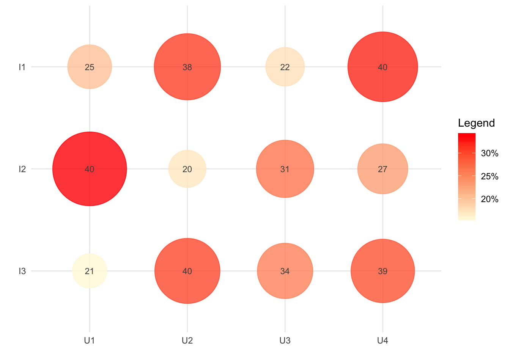

# Bibliometric plots

Bibliometric plots in R

## Installation

``` r
# Install from GitHub
# install.packages('devtools')
devtools::install_github('Wences91/bibplots')
```

## Example

Create a random data.frame with some indicators.

``` r
set.seed(958)

library(bibplots)

test <- data.frame(I1=sample(20:40,4),
                   I2=sample(20:40,4),
                   I3=sample(20:40,4),
                   stringsAsFactors = FALSE)
row.names(test) <- c('U1','U2','U3','U4')
head(test)
##    I1 I2 I3
## U1 25 40 21
## U2 38 20 40
## U3 22 31 34
## U4 40 27 39
```

Obtain the plot.

``` r
p <- bibplots::point_indicators(indicators = test, size=3)
p
```


