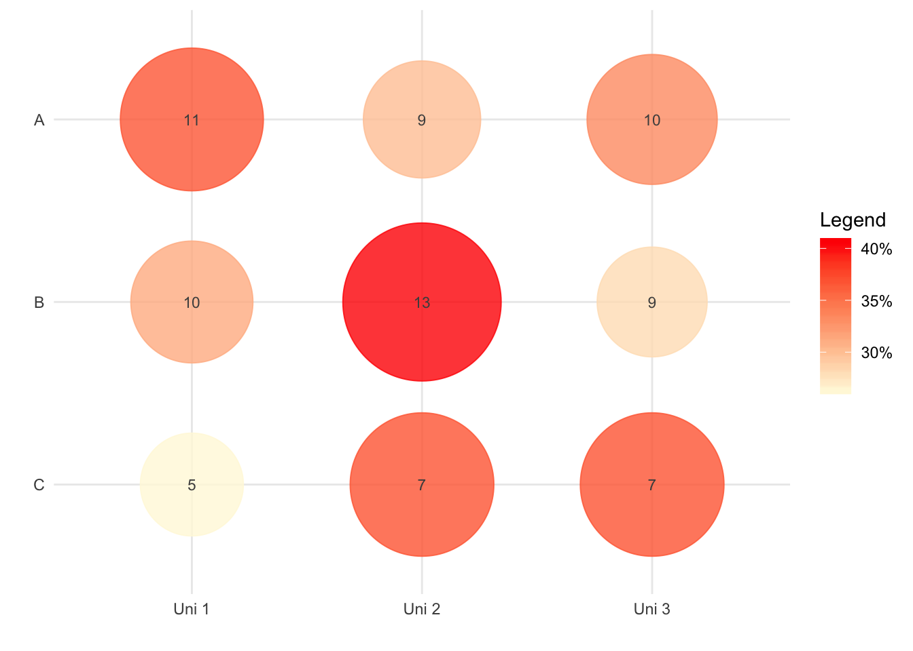

# Bibliometric plots

Bibliometric plots in R

## Installation

``` r
# Install from GitHub
# install.packages('devtools')
devtools::install_github('Wences91/bibplots')
```

## Example

``` r
library(bibplots)
test <- data.frame(uni=c(rep('Uni 1',3),rep('Uni 2',3),rep('Uni 3',3)),
                   indicator=rep(c('A','B','C'),3),
                   value=trunc(runif(9,5,15)),
                   stringsAsFactors=FALSE)
p <- bibplots::point_indicators(indicators = test, size=3)
p
```


